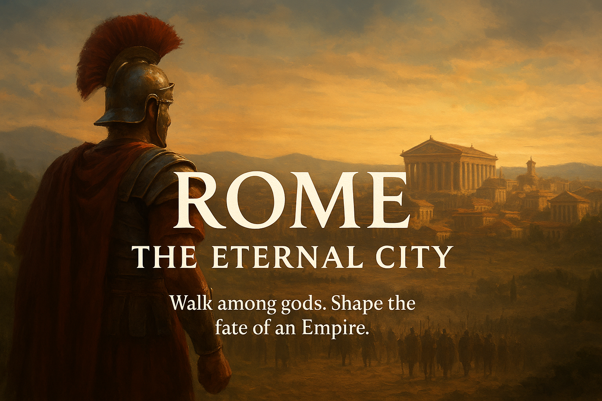

<p align="center">
  
</p>

# Rome — An Evennia-Based Multiplayer Text Adventure

**Rome** is a custom multiplayer text-based game built using the  
[Evennia MUD framework (Python + Django)](https://www.evennia.com/).  
Players explore, scheme, build power, command legions, and shape the fate of an empire.

---

### Play the Game
**Homepage:** https://rome.vineyard.haus/

---

### Project Overview

This project blends elements of:
- Roman history and mythology  
- Political roleplay and intrigue  
- PvE and PvP progression  
- Exploration, faction conflicts, and character development

Currently playable: a full 8-class/6-race character system, a turn-based
combat engine (spells, skills, NPC AI, party-based group fights), the
Colosseum (gladiator escape questline, arena tiers, Ludus training
grounds), a small player economy with real merchants, and the
Underworld as the consequence of death. Rome the city itself is a
planned future expansion. Rome is under active development and will
keep evolving as more systems, lore, and mechanics are introduced.

---

### Branches

| Branch | Purpose |
|---------|---------|
| `main` | Stable, production-ready code |
| `dev` | Active development (features, experiments, testing) |

Development happens on `dev`.  
Only proven, stable features are merged into `main`.

---

### Local Development

```bash
# Clone the repo
git clone https://github.com/Hunter-Meares/rome.git
cd rome

# Install dependencies
pip install evennia

# First-time setup only: create your own secret key.
# server/conf/secret_settings.py is gitignored (never committed) -
# the server will still start without it, falling back to Evennia's
# own default key with a warning, but a real deployment should
# always set its own. Create the file with:
#   SECRET_KEY = "<a long random string>"
# (see server/conf/secret_settings.py.example for the exact format)

# Setup database (first time only)
evennia migrate

# Start the game
evennia start
```

